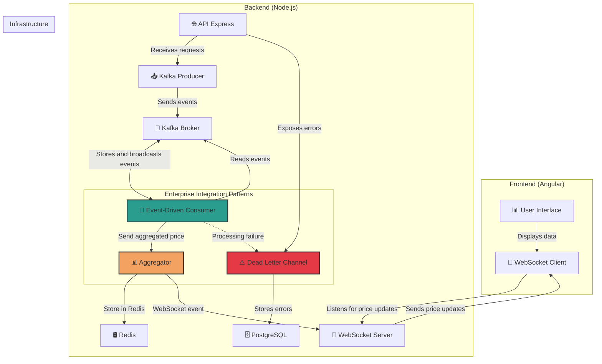

```mermaid
graph TD
  %% FRONTEND  
  subgraph "Frontend (Angular)"
    UI["📊 User Interface"]
    WSClient["🔗 WebSocket Client"]
    UI -->|Displays data| WSClient
  end

  %% BACKEND  
  subgraph "Backend (Node.js)"
    API["🌐 API Express"]
    KafkaProducer["📤 Kafka Producer"]
    
    subgraph "Enterprise Integration Patterns"
      classDef aggregator fill:#f4a261,stroke:#333,stroke-width:2px
      classDef consumer fill:#2a9d8f,stroke:#333,stroke-width:2px
      classDef deadletter fill:#e63946,stroke:#333,stroke-width:2px

      Aggregator["📊 Aggregator"]:::aggregator
      DeadLetter["⚠️ Dead Letter Channel"]:::deadletter
      Consumer["🔄 Event-Driven Consumer"]:::consumer
    end

    WebSocketServer["📡 WebSocket Server"]

    API --> |Receives requests| KafkaProducer
    KafkaProducer --> |Sends events| KafkaBroker
    Consumer --> |Reads events| KafkaBroker
    Consumer -->|Send aggregated price| Aggregator
    Aggregator --> |Store in Redis| RedisDB
    Aggregator --> |WebSocket event| WebSocketServer
    WebSocketServer --> |Sends price updates| WSClient

    Consumer -.->|Processing failure| DeadLetter
    DeadLetter --> |Stores errors| PostgreSQL
  end

  %% INFRASTRUCTURE  
  subgraph "Infrastructure"
    KafkaBroker["📡 Kafka Broker"]
    RedisDB["🛢️ Redis"]
    PostgreSQL["🗄️ PostgreSQL"]
    KafkaBroker <--> |Stores and broadcasts events| Consumer
  end

  WSClient --> |Listens for price updates| WebSocketServer
  API --> |Exposes errors| DeadLetter
```