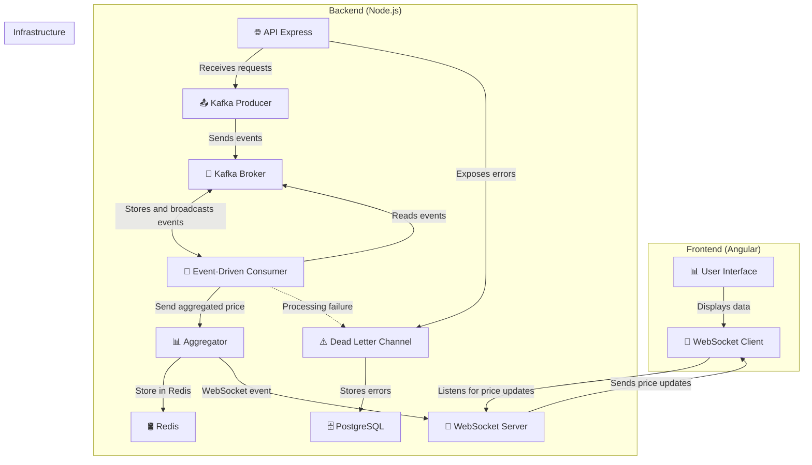

```mermaid
graph TD
  subgraph "Frontend (Angular)"
    UI["📊 User Interface"]
    WSClient["🔗 WebSocket Client"]
    UI -->|Displays data| WSClient
  end

  subgraph "Backend (Node.js)"
    API["🌐 API Express"]
    KafkaProducer["📤 Kafka Producer"]
    WebSocketServer["📡 WebSocket Server"]
    Aggregator["📊 Aggregator"]
    DeadLetter["⚠️ Dead Letter Channel"]
    Consumer["🔄 Event-Driven Consumer"]

    API --> |Receives requests| KafkaProducer
    KafkaProducer --> |Sends events| KafkaBroker
    Consumer --> |Reads events| KafkaBroker
    Consumer -->|Send aggregated price| Aggregator
    Aggregator --> |Store in Redis| RedisDB
    Aggregator --> |WebSocket event| WebSocketServer
    WebSocketServer --> |Sends price updates| WSClient

    Consumer -.->|Processing failure| DeadLetter
    DeadLetter --> |Stores errors| PostgreSQL
  end

  subgraph "Infrastructure"
    KafkaBroker["📡 Kafka Broker"]
    RedisDB["🛢️ Redis"]
    PostgreSQL["🗄️ PostgreSQL"]
    KafkaBroker <--> |Stores and broadcasts events| Consumer
  end

  WSClient --> |Listens for price updates| WebSocketServer
  API --> |Exposes errors| DeadLetter
```